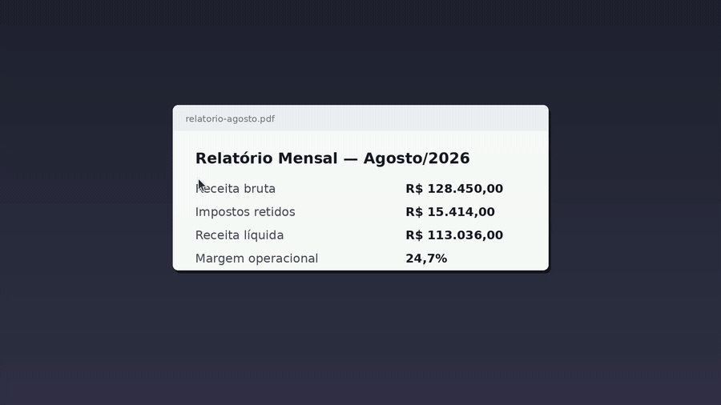
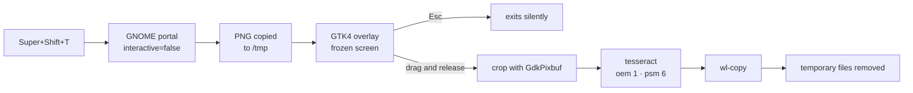

<div align="center">

# 📋 ocr-tela

**Select an area of the screen. Release the button. The text is already on your clipboard.**

The PowerToys screen OCR (`Win`+`Shift`+`T`), rebuilt for GNOME under Wayland —
no preview, no toolbar, no image saved anywhere.

[](LICENSE)
[](#requirements)
[](#how-it-works)
[](#privacy)

**English** · [Português](README.md)



<sub>The screen freezes and dims, you drag, and on release the text is on the clipboard.<br/>
Fictional document; the final frame shows the text the OCR actually extracted.</sub>

</div>

---

## The problem

On Linux, nearly every "capture and read text" tool drags you through a window:
pick a mode, confirm the capture, look at a preview, close the editor. And it
almost always leaves a PNG in your pictures folder that you never asked for.

The Windows OCR does none of that. You press the shortcut, drag, release — and the
text is on the clipboard. That's it. That behaviour is what `ocr-tela` reproduces.

## Internal flow



## Requirements

| Item | Detail |
|---|---|
| Desktop | GNOME under Wayland (uses the `org.freedesktop.portal.Screenshot` portal) |
| Python | 3.10+ with PyGObject, GTK 4 and GdkPixbuf |
| OCR | `tesseract` 5.x + the model for your language |
| Clipboard | `wl-clipboard` (`wl-copy`) |
| Notifications | desktop notification service — no extra dependency |

`install.sh` takes care of all of it on Debian/Ubuntu based distributions.

## Installation

```bash
git clone https://github.com/augustotecnos/ocr-tela.git
cd ocr-tela
./install.sh
```

The installer will:

1. Install any missing dependencies, all from your distribution's own repository
   (via `apt`, asking for `sudo` only at that step)
2. Install into `~/.local` through `make install`
3. Enable a `systemd --user` service that preloads the models at login
4. Register the `Super`+`Shift`+`T` shortcut, **preserving** your existing ones

Choosing other languages, another shortcut, or skipping steps:

```bash
OCR_LANGS="por eng" OCR_KEYBIND="<Control><Alt>o" ./install.sh
./install.sh --no-shortcut --no-warmup
```

To remove everything: `./uninstall.sh`

The shortcut is a separate and reversible step, handled by `ocr-tela-atalho`:

```bash
ocr-tela-atalho --binding "<Control><Alt>o"   # create or change
ocr-tela-atalho --remove                      # remove
```

### Flatpak

The manifest lives in `flatpak/`. To build and install it locally:

```bash
flatpak install --user flathub org.flatpak.Builder
flatpak run org.flatpak.Builder --force-clean --user --disable-rofiles-fuse \
  --install-deps-from=flathub --repo=repo build \
  flatpak/io.github.augustotecnos.ocr-tela.yml
flatpak install --user repo io.github.augustotecnos.ocr-tela
```

The manifest compiles leptonica and tesseract, since no ready-made module exists in
`flathub/shared-modules`, and bundles the `por` and `eng` models — byte for byte the
same files Debian's `tesseract-ocr-por` package ships.

**One mandatory first-time step.** A sandboxed app needs permission to capture the
screen without UI, and the system dialog is only shown to the focused app — which
never happens here, because the capture runs before any window exists. Grant it once:

```bash
flatpak permission-set screenshot screenshot io.github.augustotecnos.ocr-tela yes
```

**Two differences from the native build**, both consequences of the sandbox:

- The portal hands the capture over through the *document portal* and writes a copy to
  `~/Pictures/Screenshot.png` that the app has no permission to delete. It is always
  the same file, overwritten on every use, but it stays there. The native build leaves
  no trace.
- `wl-copy` has to stay alive to serve the clipboard, so the sandbox instance keeps
  running after the OCR. It does not get in the way of shortcut usage.

`flatpak-builder-lint` reports `finish-args-only-wayland`: the app is Wayland-only by
nature (the capture depends on the Wayland portal and the clipboard on `wl-copy`),
which requires requesting an exception when submitting to Flathub.

### Debian / Ubuntu (.deb)

The `debian/` directory is in the repository. To build:

```bash
sudo apt install debhelper devscripts
dpkg-buildpackage -us -uc -b      # binary package
dpkg-buildpackage -S -us -uc      # source package, for a PPA
```

The package passes `lintian` with no warnings at all, both binary and source. It
installs into `/usr`, ships the three manual pages, and delivers the
`ocr-warmup.service` unit **disabled** — enabling it is the user's choice:

```bash
systemctl --user enable --now ocr-warmup.service
```

The package also never creates a keyboard shortcut. After installing, anyone who
wants one runs `ocr-tela-atalho` once.

Two notes for whoever publishes it:

- `debian/changelog` targets Ubuntu's `resolute` series. For another series, or for
  Debian (where `unstable` is the right value), change the first line before building
  the source package.
- `debian/source/options` excludes `.flatpak-builder` from the tarball. Without it the
  Flatpak build cache is swept in and the source package jumps from 30 KB to 72 MB.

### For packagers

Do not use `install.sh` — it is the manual installation path. Use the standard target,
which honours `DESTDIR` and `PREFIX` and never touches user configuration:

```bash
make install DESTDIR=debian/ocr-tela PREFIX=/usr
make check     # validates .desktop, AppStream and syntax
```

A package must never register the shortcut or enable the service: both are user
configuration and belong to the user.

## Usage

Press `Super`+`Shift`+`T` and drag over the text.

| Action | Result |
|---|---|
| Drag and release | OCR of the area → text on the clipboard |
| `Esc` | Cancels without saying anything |
| Click without dragging | Treated as a cancellation |

It also works straight from a terminal: `ocr-tela`

## Configuration

Everything through environment variables — no config file to maintain.

| Variable | Default | What it does |
|---|---|---|
| `OCR_LANG` | `por` | Tesseract languages. Use `por+eng` for mixed text (~40% slower) |
| `OCR_NOTIFY` | `1` | `0` makes it 100% silent, not even the confirmation |
| `OCR_DIM` | `0.45` | Dimming outside the selection, from `0` to `1` |
| `OCR_MAX_SIDE` | `1400` | Crops larger than this are scaled down before the OCR |
| `OCR_TESSDATA` | *(empty)* | Alternative model directory. Empty uses the system's |

To make it permanent, edit the shortcut's command:

```bash
OCR_LANG=por+eng ocr-tela
```

## Performance

Measured on Ubuntu 26.04, CPU with no GPU acceleration:

| Step | Time |
|---|---|
| Screen capture (silent) | 0.16 s |
| OCR of a small region (500×120) | 0.49 s |
| OCR of a medium region (960×400) | 1.35 s |

Two decisions explain those numbers: `--oem 1 --psm 6` (pure LSTM, treating the
selection as a block of text) and scaling large crops down to at most 1400 px — beyond
that the OCR gets slower without gaining accuracy.

An earlier version downloaded the `tessdata_fast` models from GitHub believing they
were faster than the distribution's. On measuring, the files turned out to be **byte
for byte identical** to those in Ubuntu's `tesseract-ocr-por` package — same MD5. The
download was removed: it made no difference at all and blocked packaging.

## Privacy

Nothing leaves your machine. Tesseract runs locally and there is no network call at
runtime — the installer only ever fetches packages from your distribution's own
repository.

The capture lives in `/tmp` for about a second and is deleted in a `finally` block, so
it goes away even if the OCR fails halfway through.

## How it works

The obvious path would be to ask GNOME Shell for the area selection it already knows
how to do:

```python
org.gnome.Shell.Screenshot.SelectArea()    # returns x, y, width, height
org.gnome.Shell.Screenshot.ScreenshotArea(...)
```

Except that, from GNOME 41 onwards, those calls go through a `DBusSenderChecker` that
only allows a few well-known bus names. On GNOME 50 the answer to any ordinary script
is:

```
GDBus.Error:org.freedesktop.DBus.Error.AccessDenied: ScreenshotArea is not allowed
```

Acquiring the `org.gnome.Screenshot` bus name **no longer** works around it:
`gnome-screenshot` was deprecated and the name was dropped from the list.

The path that remains — the one this project uses — is the portal:

1. **`org.freedesktop.portal.Screenshot` with `interactive=false`** captures the whole
   desktop without displaying anything at all. With `interactive=true` you get GNOME's
   full UI, which is precisely what we are avoiding.
2. The portal writes the PNG into your pictures folder. The script **copies it to
   `/tmp` immediately** and removes the original, leaving no trace. It copies rather
   than moves because under a sandbox the file arrives through the document portal, on
   a different filesystem and with no permission to delete.
3. A **fullscreen GTK4 overlay** draws that frozen, dimmed capture. Because the image
   is already frozen, the content cannot change while you select — the same approach
   as the Snipping Tool.
4. On release, the region becomes a crop through GdkPixbuf, goes through tesseract and
   the result goes to `wl-copy`.

On multi-monitor setups one window is opened per monitor, each drawing its slice of
the capture, and the selection coordinates are converted back to image pixels taking
each monitor's geometry and scale factor into account.

## Troubleshooting

<details>
<summary><b>The shortcut does nothing</b></summary>

Test it in a terminal first: `ocr-tela`. If it works there, the shortcut is the
problem — check in *Settings → Keyboard → Custom Shortcuts* that the command points to
the absolute path (`/home/you/.local/bin/ocr-tela`). GNOME shortcuts do not inherit
your full `PATH`.
</details>

<details>
<summary><b>A dialog asks for permission to capture the screen</b></summary>

Normal on the first run. Allow it and the portal remembers the decision. To check
what is stored:

```bash
gdbus call --session --dest org.freedesktop.impl.portal.PermissionStore \
  --object-path /org/freedesktop/impl/portal/PermissionStore \
  --method org.freedesktop.impl.portal.PermissionStore.Lookup screenshot screenshot
```
</details>

<details>
<summary><b>The OCR makes too many mistakes</b></summary>

In this order:

1. Select an area that hugs the text **more tightly** — leftover margin confuses `psm 6`.
2. If the text is English or mixed, use `OCR_LANG=por+eng`.
3. For very small text, raise `OCR_MAX_SIDE` (e.g. `2000`) so it is not scaled down so much.
4. Light type on a dark background usually reads worse — if you can, zoom the source
   application in before capturing.
</details>

<details>
<summary><b>Nothing was copied / empty clipboard</b></summary>

`wl-copy` needs an active Wayland session. On X11, swap `wl-copy` for
`xclip -selection clipboard` in the script. Check that `wl-clipboard` is installed too.
</details>

<details>
<summary><b>A Vulkan warning in the terminal</b></summary>

Something like `VK_ERROR_INCOMPATIBLE_DRIVER` comes from GTK picking a renderer, not
from the script. It is harmless — GTK falls back to another backend and the overlay
works just the same.
</details>

## Known limitations

- **Built for GNOME.** Other desktops that implement the freedesktop portal may work,
  but have not been tested.
- **Multi-monitor is implemented but untested on real hardware** — only one monitor was
  available during development. Reports are welcome.
- **A selection spanning two monitors is not supported**: each window handles its own
  drag.
- There is no layout, column or table recognition — the text comes out as tesseract
  delivers it.

## Tested on

| | |
|---|---|
| System | Ubuntu 26.04 |
| GNOME | 50.1, Wayland |
| Python | 3.13 · GTK 4 · GdkPixbuf |
| tesseract | 5.5.0 (models from the `tesseract-ocr-por` package) |
| Monitors | 1 × 1920×1080, scale 1 |

## License

MIT — see [LICENSE](LICENSE).
