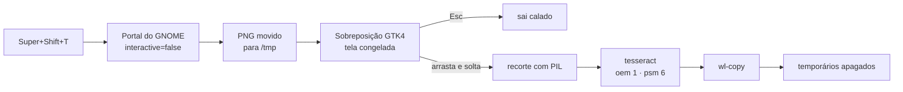

<div align="center">

# 📋 ocr-tela

**Selecione uma área da tela. Solte o botão. O texto já está no seu clipboard.**

O OCR de tela do PowerToys (`Win`+`Shift`+`T`), recriado para o GNOME no Wayland —
sem preview, sem barra de ferramentas, sem imagem salva em lugar nenhum.

[](LICENSE)
[](#requisitos)
[](#como-funciona)
[](#privacidade)

</div>

---

## O problema

No Linux, quase toda ferramenta de "capturar e ler texto" te obriga a passar por uma
janela: escolher o modo, confirmar a captura, ver um preview, fechar o editor. E quase
sempre ela deixa um PNG na sua pasta de imagens que você nunca pediu.

O OCR do Windows não faz nada disso. Você aperta o atalho, arrasta, solta — e o texto
está no clipboard. Ponto. É esse comportamento que o `ocr-tela` reproduz.

## Como fica

```
     aperta Super+Shift+T
              │
              ▼
   ┌───────────────────────┐
   │  a tela congela e     │   ← nenhuma janela nova aparece,
   │  escurece levemente   │     nenhum botão, nenhum menu
   └───────────────────────┘
              │
              ▼
   ┌───────────────────────┐
   │  ┌─────────────┐      │   ← a área que você arrasta volta
   │  │ Nota Fiscal │      │     ao brilho normal, com uma
   │  │ 1.234,56    │      │     borda fina de 1 px
   │  └─────────────┘      │
   └───────────────────────┘
              │
              ▼
        solta o botão
              │
              ▼
    o texto está no clipboard
    (nada é exibido, nada é salvo)
```

## Fluxo interno



## Requisitos

| Item | Detalhe |
|---|---|
| Área de trabalho | GNOME no Wayland (usa o portal `org.freedesktop.portal.Screenshot`) |
| Python | 3.10+ com PyGObject, GTK 4, Pillow, pycairo |
| OCR | `tesseract` 5.x + o modelo do seu idioma |
| Clipboard | `wl-clipboard` (`wl-copy`) |
| Notificações | `libnotify-bin` (`notify-send`) — opcional |

O `install.sh` resolve tudo isso por você em distros baseadas em Debian/Ubuntu.

## Instalação

```bash
git clone https://github.com/augustotecnos/ocr-tela.git
cd ocr-tela
./install.sh
```

O instalador vai:

1. Instalar as dependências que faltarem (via `apt`, pedindo `sudo` só nessa etapa)
2. Baixar os modelos **tessdata_fast** em `~/.tessdata_fast` — cerca de 2× mais rápidos
3. Copiar `ocr-tela` para `~/.local/bin`
4. Ativar um serviço `systemd --user` que pré-carrega os modelos no login
5. Registrar o atalho `Super`+`Shift`+`T`, **preservando** seus atalhos existentes

Escolhendo outros idiomas e outro atalho:

```bash
OCR_LANGS="por eng spa" OCR_KEYBIND="<Control><Alt>o" ./install.sh
```

Para remover tudo: `./uninstall.sh`

## Uso

Aperte `Super`+`Shift`+`T` e arraste sobre o texto.

| Ação | Resultado |
|---|---|
| Arrastar e soltar | OCR da área → texto no clipboard |
| `Esc` | Cancela sem dizer nada |
| Clique sem arrastar | Tratado como cancelamento |

Também funciona direto no terminal: `ocr-tela`

## Configuração

Tudo por variável de ambiente — nada de arquivo de config para manter.

| Variável | Padrão | O que faz |
|---|---|---|
| `OCR_LANG` | `por` | Idiomas do tesseract. Use `por+eng` para texto misto (~40% mais lento) |
| `OCR_NOTIFY` | `1` | `0` deixa 100% silencioso, sem nem a confirmação |
| `OCR_DIM` | `0.45` | Escurecimento fora da seleção, de `0` a `1` |
| `OCR_MAX_SIDE` | `1400` | Recortes maiores são reduzidos antes do OCR |
| `OCR_TESSDATA` | `~/.tessdata_fast` | Pasta dos modelos |

Para deixar permanente, edite o comando do atalho:

```bash
OCR_LANG=por+eng ocr-tela
```

## Desempenho

Medido num Ubuntu 26.04, CPU sem aceleração de GPU:

| Etapa | Tempo |
|---|---|
| Captura da tela (silenciosa) | 0,16 s |
| OCR de região pequena (500×120) | 0,49 s |
| OCR de região média (960×400) | 1,35 s |

Três decisões explicam esses números: os modelos `tessdata_fast` no lugar dos padrão,
`--oem 1 --psm 6` (LSTM puro, tratando a seleção como um bloco de texto) e a redução
de recortes grandes para no máximo 1400 px — acima disso o OCR fica mais lento sem
ganhar precisão.

## Privacidade

Nada sai da sua máquina. O tesseract roda localmente e não há nenhuma chamada de rede
em tempo de execução — o único download acontece uma vez, no instalador, para pegar os
modelos de idioma.

A captura vive por volta de um segundo em `/tmp` e é apagada num bloco `finally`, então
some mesmo se o OCR falhar no meio.

## Como funciona

O caminho óbvio seria pedir ao GNOME Shell a seleção de área que ele já sabe fazer:

```python
org.gnome.Shell.Screenshot.SelectArea()    # devolve x, y, largura, altura
org.gnome.Shell.Screenshot.ScreenshotArea(...)
```

Só que, do GNOME 41 em diante, essas chamadas passam por um `DBusSenderChecker` que só
libera alguns nomes conhecidos do barramento. No GNOME 50 a resposta para qualquer
script comum é:

```
GDBus.Error:org.freedesktop.DBus.Error.AccessDenied: ScreenshotArea is not allowed
```

Adquirir o nome `org.gnome.Screenshot` no barramento **não** contorna mais isso: o
`gnome-screenshot` foi descontinuado e o nome saiu da lista.

O caminho que sobra — e que este projeto usa — é o portal:

1. **`org.freedesktop.portal.Screenshot` com `interactive=false`** captura a área de
   trabalho inteira sem exibir absolutamente nada. Com `interactive=true` você recebe a
   UI completa do GNOME, que é justamente o que queremos evitar.
2. O portal grava o PNG na sua pasta de imagens. O script **move o arquivo para `/tmp`
   imediatamente**, para não deixar rastro.
3. Uma **sobreposição GTK4 em tela cheia** desenha essa captura congelada, escurecida.
   Como a imagem já está congelada, o conteúdo não muda enquanto você seleciona — a
   mesma abordagem do Snipping Tool.
4. Ao soltar o botão, a região vira um recorte com Pillow, passa pelo tesseract e o
   resultado vai para o `wl-copy`.

Em telas com múltiplos monitores, abre-se uma janela por monitor, cada uma desenhando
sua fatia da captura, e as coordenadas da seleção são convertidas de volta para pixels
da imagem levando em conta a geometria e o fator de escala de cada monitor.

## Solução de problemas

<details>
<summary><b>O atalho não faz nada</b></summary>

Teste no terminal primeiro: `ocr-tela`. Se funcionar ali, o problema é o atalho —
confira em *Configurações → Teclado → Atalhos personalizados* se o comando aponta para
o caminho absoluto (`/home/voce/.local/bin/ocr-tela`). Atalhos do GNOME não herdam seu
`PATH` completo.
</details>

<details>
<summary><b>Aparece um diálogo pedindo permissão para capturar a tela</b></summary>

Normal na primeira vez. Autorize e o portal guarda a decisão. Para conferir o que está
registrado:

```bash
gdbus call --session --dest org.freedesktop.impl.portal.PermissionStore \
  --object-path /org/freedesktop/impl/portal/PermissionStore \
  --method org.freedesktop.impl.portal.PermissionStore.Lookup screenshot screenshot
```
</details>

<details>
<summary><b>O OCR erra muito</b></summary>

Nesta ordem:

1. Selecione uma área **mais justa** ao texto — margem sobrando atrapalha o `psm 6`.
2. Se o texto for em inglês ou misto, use `OCR_LANG=por+eng`.
3. Para texto muito pequeno, aumente `OCR_MAX_SIDE` (ex.: `2000`) para não reduzir demais.
4. Fonte clara sobre fundo escuro costuma render menos — se possível, aumente o zoom
   da aplicação de origem antes de capturar.
</details>

<details>
<summary><b>Não copiou nada / clipboard vazio</b></summary>

O `wl-copy` precisa de uma sessão Wayland ativa. Em X11, troque `wl-copy` por
`xclip -selection clipboard` no script. Confira também se `wl-clipboard` está instalado.
</details>

<details>
<summary><b>Aviso sobre Vulkan no terminal</b></summary>

Algo como `VK_ERROR_INCOMPATIBLE_DRIVER` vem do GTK escolhendo o renderizador, não do
script. É inofensivo — o GTK cai para outro backend e a sobreposição funciona igual.
</details>

## Limitações conhecidas

- **Feito para o GNOME.** Outros ambientes que implementam o portal freedesktop podem
  funcionar, mas não foram testados.
- **Múltiplos monitores estão implementados, porém não testados em hardware real** —
  só havia um monitor disponível durante o desenvolvimento. Relatos são bem-vindos.
- **Seleção que atravessa dois monitores não é suportada**: cada janela trata seu
  próprio arrasto.
- Não há reconhecimento de layout, colunas ou tabelas — o texto sai como o tesseract
  o entrega.

## Testado em

| | |
|---|---|
| Sistema | Ubuntu 26.04 |
| GNOME | 50.1, Wayland |
| Python | 3.13 · GTK 4 · Pillow 12.1 |
| tesseract | 5.5.0 (modelos `tessdata_fast`) |
| Monitores | 1 × 1920×1080, escala 1 |

## Licença

MIT — veja [LICENSE](LICENSE).
